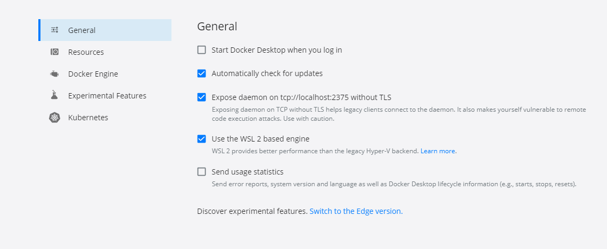

# Задача «Интеграционное тестирование»

Теперь, когда вы умеете создавать образы и знаете, что возможно их тестировать из java-кода, можно протестировать [приложение из первого задания этого модуля](../../spring_boot/task1/README.md).

## Описание

**Шаг 0.** Если ваш компьютер использует ОС Windows, тогда проверьте, что в `Docker desktop` в настройках, во вкладке General стоит галочка напротив пункта `Expose daemon on...`, как на скрине ниже. 


**Шаг 1.** Сначала вам надо собрать jar-архивы с вашими Spring Boot приложениями. Для этого в терминале, в корне вашего проекта выполните команду.
                                                                               
Для gradle: `./gradlew clean build` (если пишет Permission denied, тогда сначала выполните `chmod +x ./gradlew`).
                                                                               
Для maven: `./mvnw clean package` (если пишет Permission denied, тогда сначала выполните `chmod +x ./mvnw`).

**Шаг 2**. Теперь вы соберёте два образа для разных окружений — dev и prod. Для этого:

 - для первого установите порт `server.port=8080` и профиль в dev с помощью параметра `netology.profile.dev=true` в application.properties и соберите приложение:
 
   - для gradle: `./gradlew clean build` (если пишет Permission denied, тогда сначала выполните `chmod +x ./gradlew`);
    
   - для maven: `./mvnw clean package` (если пишет Permission denied, тогда сначала выполните `chmod +x ./mvnw`);
 - добавьте Dockerfile в корень проекта:
 
```
FROM openjdk:8-jdk-alpine
EXPOSE 8080
ADD build/libs/<название вашего архива>.jar myapp.jar
ENTRYPOINT ["java","-jar","/myapp.jar"]
```
Если вы собирали с помощью maven, тогда jar будет лежать в папке `target`, а если с gradle — в `build/libs`, и, соответственно, в `ADD` надо прописывать путь исходя из сборщика, который вы использовали.

 - теперь соберите образ, выполнив в корне проекта в терминале команду `docker build -t devapp .`. Так вы соберёте ваше приложение в образ с названием `devapp`.
 
**Шаг 3.** Сейчас вам нужно собрать второй образ из этого же приложения, но с другими параметрами:

 - установите порт `server.port=8081` и профиль в prod с помощью параметра `netology.profile.dev=false` в application.properties и соберите приложение, как в предыдущем пунтке;
 - измените в Dockerfile параметр `EXPOSE` с 8080 на 8081;
 - соберите образ, выполнив в корне проекта в терминале команду `docker build -t prodapp .`. Так вы соберёте ваше приложение в образ с названием `prodapp`.
 
**Шаг 4.** Напишите ваш интеграционный тест:

 - добавьте в зависимость проекта:
  
Для gradle:
    
```testImplementation 'org.testcontainers:junit-jupiter:1.15.1'```
 
Для maven:
         
    
```
<dependency>
    <groupId>org.testcontainers</groupId>
    <artifactId>junit-jupiter</artifactId>
    <version>1.15.1</version>
    <scope>test</scope>
</dependency>
```
 - напишите тестовый класс в директории `src/test`:
 
```java
@SpringBootTest(webEnvironment = SpringBootTest.WebEnvironment.RANDOM_PORT)
class DemoApplicationTests {
    @Autowired
    TestRestTemplate restTemplate;

    @BeforeAll
    public static void setUp() {
     
    }

    @Test
    void contextLoads() {
        ResponseEntity<String> forEntity = restTemplate.getForEntity("http://localhost:" + myapp.getMappedPort(8080), String.class);
        System.out.println(forEntity.getBody());
    }

}
```

 - здесь вам надо создать два своих `GenericContainer` в полях класса — каждый под свой образ, который вы создали ранее. 
 - в методе `setUp()` стартуйте контейнеры своих образов.
 - напишите два юнит-теста для проверки корректности того, что вернёт вам ваше приложение. Для этого используйте объект класса `TestRestTemplate`, который представлен в примере. С помощью него сделайте запрос. Чтобы понять, на каком порту запущен ваш контейнер, воспользуйтесь методом `getMappedPort`, как на примере из лекции. И для проверки корректности ответа проверьте с помощью метода `assertEquals`.
 

 
 


